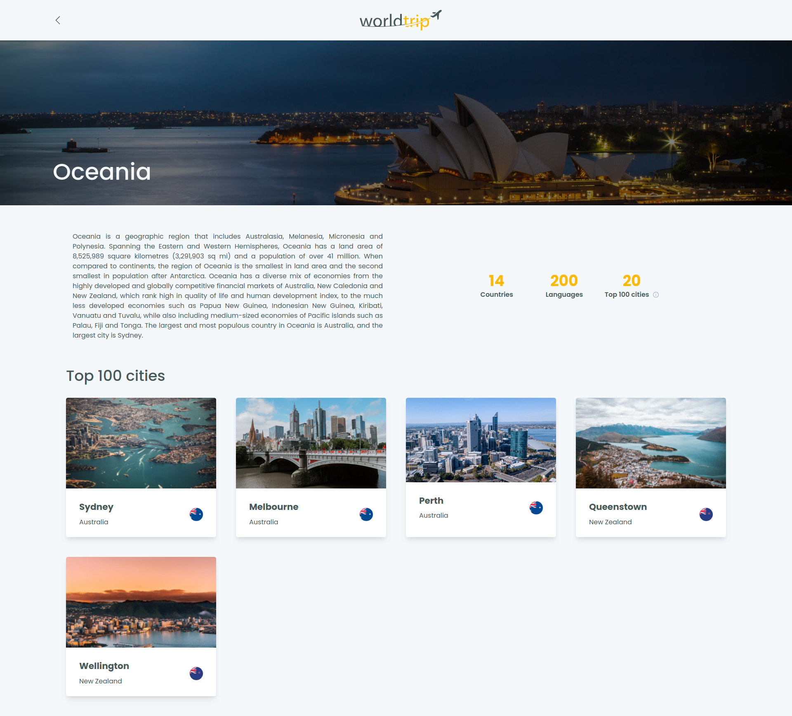

  

## About
<strong>World Trip</strong> is a cool way to find your next destination.

## Screenshots

### Home

### Continent details

## Technologies

### React

### Chakra UI

### Typescript

## How to use it
1. Clone the project with git clone `https://github.com/Eduardo-H/world-trip`
2. Enter the project's directory with `cd world-trip/`
3. Install all the project's dependencies by running `yarn`
4. Open another terminal window and run the local server with `yarn server`
5. Run the project with `yarn dev`

PS: The server must be running for the application to work.